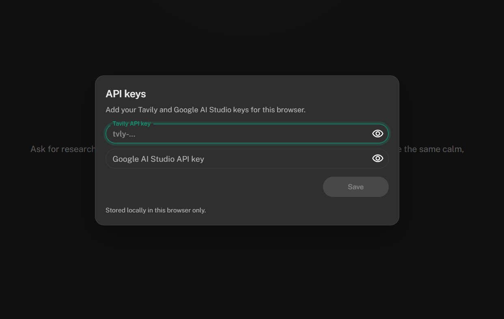
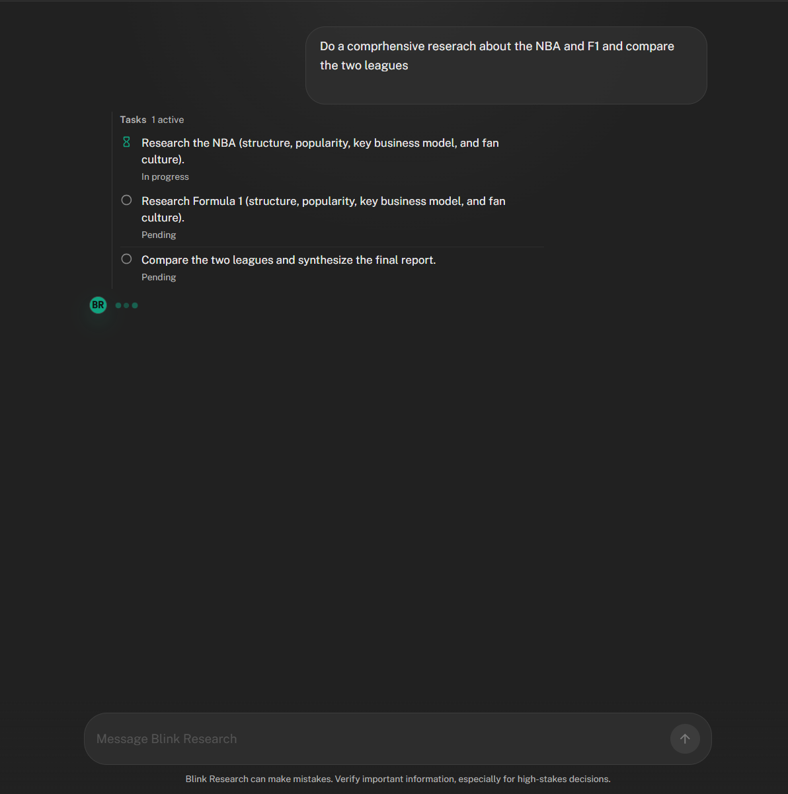
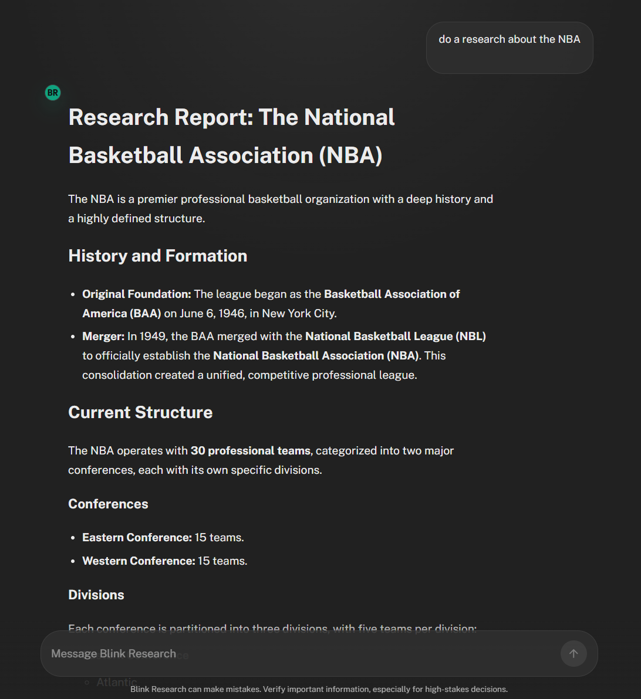

# BlinkResearch

AI-powered research chat with real-time multi-agent progress streaming.

Live app: `https://d49jore6lxrzy.cloudfront.net`

## What It Does

- Runs an orchestrator + research agent workflow for complex queries.
- Streams progress events (`started`, `todos`, `final`, `error`) to the UI.
- Supports thread-based follow-up conversations.
- Lets users provide their own Tavily + Google AI Studio keys at runtime.

## Quick Start

### 1) Backend (FastAPI)

```bash
cd backend
python -m venv .venv
# Windows PowerShell: .\.venv\Scripts\Activate.ps1
# macOS/Linux: source .venv/bin/activate
pip install -r requirements.txt
uvicorn app.main:app --host 0.0.0.0 --port 8000 --reload
```

Backend will run on `http://localhost:8000`.

### 2) Frontend (React + Vite)

```bash
cd frontend
npm install
npm run dev
```

Frontend will run on `http://localhost:5173`.

## Core Commands

```bash
# Frontend build output is in frontend/build
cd frontend
npm run build

# Frontend lint
npm run lint
```

```bash
# Backend container build/run
cd backend
docker build -t blinkresearch-backend .
docker run -p 8000:8000 blinkresearch-backend
```

## API (Short Reference)

- `GET /health` - health check.
- `POST /api/agent/invoke` - run request and return final response.
- `POST /api/agent/stream` - stream NDJSON events for progress + final output.

Request body:

```json
{
  "query": "Research AI model routing strategies",
  "thread_id": null,
  "api_keys": {
    "tavily_api_key": "...",
    "google_studio_api_key": "..."
  }
}
```

## Project Layout

```text
backend/
  app/
    main.py
    services/agent.py
    agents/
      orchestrator/
      research/
frontend/
  src/features/chat/
  public/
```

## Screenshots

### API key setup



### Agent task progress



### Final research output

